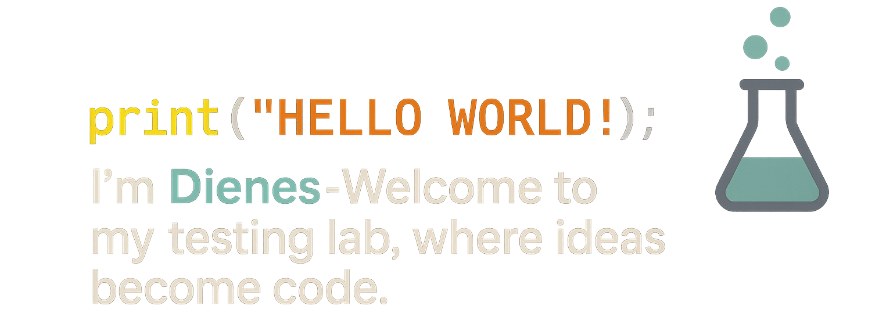

  

 

I'm a passionate QA Automation Engineer and developer from Brazil 🇧🇷

**About me**

- 💼 Automation Engineer  
- 📈 Built Cypress + Cucumber projects, test suites, and more  
- ❤️ I love testing, automating repetitive tasks, and experimenting with new tools  
- 💬 Ask me about QA, Cypress, Cucumber, JavaScript, or automation [here](https://github.com/dieneslab/issues)

<code></code>
<code></code>
<code></code>
<code></code>
<code></code>

 

Follow me: 

